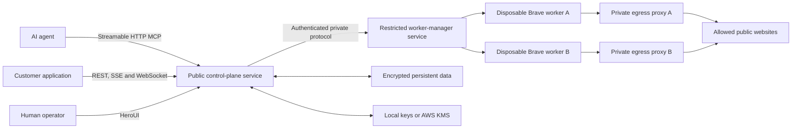

# BrowserSilo realtime gateway and container distribution PRD

## Problem Statement

BrowserSilo already proves that an AI agent can operate a real headed Brave browser in a disposable, tenant-isolated Docker worker while preserving an encrypted browser identity and producing encrypted evidence artifacts. However, the current product is not yet a turnkey network service. The BrowserSilo service and public stdio MCP adapter run from the repository on the host, while only the disposable Brave worker is packaged as an image.

This creates four user-facing problems:

1. An operator cannot install the complete product with one container-oriented command.
2. An existing application cannot integrate through a stable, language-neutral network contract without adopting BrowserSilo's Node.js implementation details.
3. REST alone cannot provide a low-latency live browser view, continuous events, or bidirectional human takeover.
4. The current agent-facing vocabulary exposes infrastructure concepts such as profiles, leases, workers, and fencing that should remain internal to BrowserSilo.

The user wants BrowserSilo to feel like a normal remote browser service: applications create or resume a browser identity, issue ordinary browser actions, observe progress, watch or take over the browser when necessary, collect evidence, and close the browser. BrowserSilo must privately handle worker allocation, isolation, concurrency, encryption, persistence, recovery, and destruction.

The product must retain the security property that an agent never receives Docker access, raw CDP access, host paths, another tenant's state, or direct access to private networks.

## Solution

BrowserSilo will become a REST-first realtime browser platform distributed as two BrowserSilo image artifacts and a one-command Compose deployment.

The two image artifacts are:

1. A trusted control-plane image containing the Browser API, Streamable HTTP MCP gateway, Server-Sent Events endpoint, WebSocket live-session gateway, HeroUI operator interface, encryption and persistence services, scheduling, policy enforcement, and a restricted worker-manager run mode.
2. An untrusted disposable Brave worker image containing headed Brave, Xvfb, the private agent-browser MCP runtime, FFmpeg, clipboard support, and worker-side brokerage helpers.

Compose will run the trusted image in two roles: a public control-plane service without Docker privileges and an internal worker-manager service that is the only component allowed to manage Docker. This preserves the two-image distribution while keeping the Docker authority out of the internet-facing process.

The canonical integration contract will be:

- Versioned REST for browser identity, browser lifecycle, browser actions, captures, policies, and artifact metadata.
- Streaming HTTP for uploads and downloads.
- Server-Sent Events for resumable lifecycle, progress, capture, and audit events.
- A versioned native WebSocket protocol for binary live frames, observer mode, human input, and explicit takeover.
- Streamable HTTP MCP for AI agents, implemented as a thin adapter over the same application services as REST.
- The existing stdio MCP adapter retained as a compatibility client for agents that cannot connect to remote MCP.

The public API will use human-oriented concepts such as browser, identity, recording, capture, and artifact. Lease identifiers, fencing tokens, Docker worker identifiers, raw CDP endpoints, and materialized profile paths remain private implementation details.

Applications may use BrowserSilo headlessly without loading the HeroUI control plane. They integrate directly through the public network contract. A BrowserSilo service must still run somewhere, either as the application's self-hosted Compose deployment or as a separately hosted BrowserSilo service.

## User Stories

1. As an end user, I want to ask an agent to browse a website in ordinary language, so that I do not need to understand BrowserSilo infrastructure.
2. As an end user, I want the browser to remember my cookies, history, logins, storage, and preferences, so that it behaves like my regular browser across tasks.
3. As an end user, I want to sign in manually without revealing credentials to the agent, so that I can establish authenticated sessions safely.
4. As an end user, I want to watch what the agent is doing, so that I can understand and trust its progress.
5. As an end user, I want to take over the browser temporarily, so that I can complete sensitive or ambiguous interactions myself.
6. As an end user, I want to return control to the agent, so that it can continue from a fresh understanding of the page.
7. As an end user, I want the agent to ask before purchasing, booking, sending, publishing, or deleting, so that browsing does not silently become an irreversible action.
8. As an end user, I want recordings and screenshots of important workflows, so that I can review what happened.
9. As an end user, I want a complete evidence package for a website session, so that I can analyze or automate the website later.
10. As an end user, I want my browser identity deleted completely when requested, so that retained browser data is under my control.
11. As an AI agent, I want a standard remote MCP endpoint, so that I can use BrowserSilo without installing a custom SDK.
12. As an AI agent, I want browser tools to appear alongside my other MCP tools, so that browser use fits my existing tool loop.
13. As an AI agent, I want browser setup and cleanup handled automatically, so that my prompts do not mention leases, workers, or fencing.
14. As an AI agent, I want stable accessibility references, so that I can interact with real interfaces reliably.
15. As an AI agent, I want typed browser actions and structured failures, so that I can recover without guessing what happened.
16. As an AI agent, I want batch actions, so that common interaction sequences do not require excessive network round trips.
17. As an AI agent, I want resumable browser events, so that a temporary connection interruption does not erase task progress.
18. As an AI agent, I want a current snapshot after a human takeover, so that I do not act on stale page state.
19. As an AI agent, I want file uploads and downloads brokered through artifacts, so that I never require host filesystem access.
20. As an AI agent, I want website policies enforced by BrowserSilo, so that I cannot accidentally reach disallowed or private destinations.
21. As an integrator, I want a versioned REST API, so that I can integrate from any programming language.
22. As an integrator, I want an OpenAPI document, so that I can generate a client in my preferred language.
23. As an integrator, I want to use BrowserSilo without its bundled UI, so that I can retain my existing control plane.
24. As an integrator, I want to use BrowserSilo without running a local Node adapter, so that deployment remains language-neutral.
25. As an integrator, I want a Streamable HTTP MCP endpoint, so that remote agents can connect directly.
26. As an integrator, I want the stdio MCP compatibility adapter to remain available, so that older MCP clients continue to work.
27. As an integrator, I want idempotent lifecycle operations, so that retries cannot create duplicate browsers or repeat destructive actions.
28. As an integrator, I want opaque browser identifiers, so that internal Docker and concurrency details remain encapsulated.
29. As an integrator, I want browser-scoped event streams, so that I can display progress in my own application.
30. As an integrator, I want binary live frames over WebSocket, so that I can build a responsive viewer without base64 overhead.
31. As an integrator, I want separate observer and controller permissions, so that spectators cannot inject browser input.
32. As an integrator, I want HTTP streaming for large artifacts, so that recordings and traces do not need to fit in memory.
33. As an integrator, I want stable error codes and retry guidance, so that my application can distinguish capacity, policy, authentication, browser, and infrastructure failures.
34. As an integrator, I want health, readiness, and version endpoints, so that I can operate BrowserSilo with standard infrastructure.
35. As an integrator, I want tenant identity inferred from authentication, so that callers cannot impersonate another tenant through request fields.
36. As an operator, I want to start BrowserSilo with one Compose command, so that installation is predictable.
37. As an operator, I want only the internal worker manager to hold Docker authority, so that the public service is not equivalent to host root.
38. As an operator, I want the worker manager to accept only approved BrowserSilo operations, so that it cannot become a general Docker remote-control API.
39. As an operator, I want to configure capacity and per-tenant quotas, so that one tenant cannot exhaust the deployment.
40. As an operator, I want to configure worker memory, CPU, PID, and queue limits, so that browser workloads remain bounded.
41. As an operator, I want to configure domain policies and private-network protection, so that browser egress matches my security requirements.
42. As an operator, I want to select local or AWS KMS key custody, so that the deployment fits development and production environments.
43. As an operator, I want encrypted storage on a persistent volume, so that service replacement does not lose browser identities or artifacts.
44. As an operator, I want profiles and artifacts to remain recoverable after a control-plane restart, so that planned upgrades do not interrupt durable state.
45. As an operator, I want abandoned workers, proxies, and networks reconciled automatically, so that crashes do not leak resources.
46. As an operator, I want metrics, traces, audit events, and resource accounting, so that I can understand reliability and cost.
47. As an operator, I want WebSocket viewer limits and backpressure metrics, so that slow clients cannot exhaust memory.
48. As an operator, I want short-lived viewer and takeover credentials, so that copied live-view URLs do not grant durable access.
49. As an operator, I want rolling control-plane upgrades without returning used workers to the clean pool, so that upgrades do not weaken isolation.
50. As a security administrator, I want raw CDP to remain inaccessible, so that clients cannot bypass BrowserSilo policy and ownership checks.
51. As a security administrator, I want every request and WebSocket message authorized against its browser and tenant, so that a valid connection cannot cross boundaries.
52. As a security administrator, I want WebSocket origin validation, message validation, and rate limits, so that the realtime interface cannot be abused.
53. As a security administrator, I want private, loopback, link-local, metadata, and disallowed destinations blocked, so that browsers cannot probe internal infrastructure.
54. As a security administrator, I want independent profile and artifact data keys, so that deletion and rotation have narrow cryptographic scope.
55. As a security administrator, I want the public control plane to run without the Docker socket, so that an internet-facing compromise does not immediately become host compromise.
56. As a developer, I want a single application service behind REST and MCP, so that business rules are not duplicated between transports.
57. As a developer, I want transport adapters to contain no lifecycle or ownership logic, so that behavior remains consistent.
58. As a developer, I want a versioned WebSocket message schema, so that clients and servers can negotiate compatible behavior.
59. As a developer, I want real-site acceptance tests, so that BrowserSilo proves human-compatible browsing rather than only mock-page mechanics.
60. As a developer, I want deterministic protocol tests for difficult edge conditions, so that real-site variability does not hide transport regressions.
61. As a developer, I want one command to build, run, exercise, collect evidence from, and tear down the complete deployment, so that completion is reproducible.
62. As a developer, I want failed end-to-end runs to retain diagnostics while still removing managed Docker resources, so that failures can be investigated safely.
63. As a release manager, I want both image artifacts versioned together, so that compatibility between the trusted service and disposable workers is explicit.
64. As a release manager, I want image digests recorded in the release evidence, so that a passing test can be tied to immutable artifacts.
65. As a release manager, I want compatibility checks during startup, so that mismatched control-plane and worker versions fail clearly.

## Implementation Decisions

1. REST is the canonical public contract. SDKs may be generated from OpenAPI but will not contain business logic.
2. The public API is versioned from its first release. Breaking changes require a new major API namespace or an explicit negotiated protocol version.
3. The application core remains framework-independent. REST, SSE, WebSocket, Streamable HTTP MCP, stdio MCP, HeroUI, persistence, key management, Docker, and future orchestrators remain adapters around the same application services.
4. Public vocabulary uses browser, identity, capture, recording, artifact, policy, and tenant. Lease, fencing, worker, runtime reference, CDP port, and profile materialization remain internal.
5. Creating a browser accepts an identity name or identifier, an allowed-domain policy, requested capabilities, and optional recording or capture defaults. It returns an opaque browser identifier and links for supported event and live channels.
6. The service owns exclusivity and stale-command protection internally. Public clients do not pass fencing tokens.
7. Browser creation, closure, capture start, capture stop, and other retry-sensitive mutations support idempotency keys.
8. Browser actions use a discriminated, versioned action schema. Navigation, snapshot, click, type, keyboard, pointer, scroll, form, tab, frame, dialog, clipboard, file, diagnostics, and browser-emulation actions remain typed.
9. A batch action endpoint accepts an ordered list of typed actions, supports stop-on-error behavior, and returns an ordered result list.
10. REST responses contain structured error codes, human-readable messages, retryability, and safe details. Internal paths, raw command lines, credentials, and CDP locations are never serialized.
11. Server-Sent Events carry lifecycle, readiness, navigation, capture progress, artifact creation, policy denial, warning, and audit-safe failure events.
12. Every SSE event has a monotonically ordered event identifier within its stream. Clients may resume with the standard last-event identifier mechanism. When a replay window has expired, the service instructs the client to fetch current state before continuing.
13. WebSocket is reserved for genuinely realtime, bidirectional behavior. Ordinary agent actions remain REST or MCP operations.
14. The WebSocket protocol uses JSON control messages and binary image frames. Initial versions target 10 to 15 frames per second using an efficient image encoding; frame rate and quality may adapt to bandwidth.
15. Live-frame backpressure is latest-frame-wins. Old frames are discarded rather than queued when a viewer is slow.
16. WebSocket roles are observe, assist, and take-over. Observe receives frames and safe events. Assist may send explicitly allowed input. Take-over grants exclusive human input authority and pauses agent input until control is returned or the takeover expires.
17. Returning control invalidates the agent's previous page references and requires a fresh snapshot before further agent input.
18. WebSocket authentication uses short-lived, browser-scoped credentials. Authorization, browser ownership, connection limits, origin policy, message size, schema, coordinates, keys, and rate limits are enforced server-side.
19. WebSocket is not a raw CDP bridge. The public protocol exposes only reviewed BrowserSilo messages and input operations.
20. The existing authenticated multipart image stream remains available during migration and may be deprecated only after WebSocket live view reaches parity.
21. Uploads and downloads use streaming HTTP with bounded sizes, declared content types, integrity metadata, and owner-scoped artifact identifiers.
22. Artifact download authorization is checked at request time. Short-lived signed download URLs may be supported but cannot outlive artifact or tenant authorization.
23. Streamable HTTP MCP exposes the same 145-tool logical surface, updated so lifecycle tools present human-oriented browser semantics. Tool implementations call the shared application services rather than calling public REST over loopback.
24. The stdio MCP adapter remains a thin network client for compatibility. It holds no browser lifecycle or policy logic.
25. The HeroUI control plane consumes the public Admin API and realtime event interfaces. It does not import the application core directly.
26. BrowserSilo ships two image artifacts: the trusted control-plane image and the disposable Brave worker image.
27. The trusted image supports separate server and worker-manager run modes. Compose runs them as separate services from the same immutable image.
28. The public server service has no Docker socket or equivalent orchestrator authority.
29. The internal worker-manager service is the only Compose component with Docker authority. It listens only on the private service network and authenticates control-plane requests.
30. The worker-manager contract is narrow and allowlisted: create an approved worker, inspect a managed resource, execute an approved private operation, stream a brokered file, stop and destroy a worker, and reconcile BrowserSilo-labeled resources.
31. The worker manager rejects arbitrary images, commands, entrypoints, host mounts, ports, networks, capabilities, privileged mode, and unlabeled resources.
32. Local Compose may use the Docker socket only in the isolated worker-manager service. Production documentation recommends a hardened Docker authorization boundary or a future Kubernetes/containerd provider.
33. Each active browser continues to receive a fresh tenant-bound Brave worker and isolated internal network. Used workers are never returned to clean capacity.
34. The per-browser egress proxy remains the only route to public websites and enforces domain and private-network policy.
35. CDP remains bound to worker loopback and is never published to the host, Compose network, public API, or client.
36. The private agent-browser MCP package remains inside the worker image and is launched on demand through the worker-management boundary.
37. Browser profile plaintext exists only while materialized for an active worker. Normal closure flushes Brave before the profile is encrypted and the worker is destroyed.
38. Profiles and artifacts retain independent envelope-encrypted data keys with authenticated context. Local and AWS KMS providers remain supported.
39. Persistent control state, encrypted profiles, encrypted artifacts, and operator settings use declared persistent volumes or configured external storage.
40. The service advertises build version, API version, MCP protocol support, WebSocket protocol support, and compatible worker-image range.
41. Startup rejects an incompatible worker version before accepting browser work.
42. Health distinguishes process liveness, service readiness, storage readiness, key-management readiness, and worker-manager readiness.
43. Every public request receives a trace identifier. Browser, tenant, identity, and artifact identifiers are recorded in audit-safe form without secrets.
44. The public network contract is complete enough that an integrator can ignore the bundled HeroUI interface entirely.
45. No handwritten language SDK is required for the first release. OpenAPI is the client-generation source of truth.

## Testing Decisions

1. The confirmed primary acceptance seam is one running public BrowserSilo gateway. The end-to-end harness exercises REST, SSE, WebSocket, Streamable HTTP MCP, streaming artifacts, and the HeroUI health surface against real disposable Brave workers.
2. The primary acceptance test treats Docker commands, private worker MCP, CDP, encryption file formats, and internal state transitions as implementation details. It asserts only externally observable behavior and post-run security invariants.
3. The canonical command is `make test-e2e`. It is responsible for preflight, image build, isolated deployment startup, test execution, evidence collection, shutdown, and orphan audit.
4. The command uses a unique Compose project and run identifier so it cannot attach to or delete unrelated containers, networks, volumes, or artifacts.
5. The command obtains real-model credentials from the configured `browsersilo` environment namespace without writing secret values to disk or logs.
6. The public REST portion proves health, authentication, browser creation, natural browser actions, batching, capture, artifact metadata, browser closure, idempotent retry behavior, and structured errors.
7. The SSE portion proves ordered lifecycle delivery, progress events, disconnect, resume, replay, and expired-replay recovery.
8. The WebSocket portion proves authenticated connection, binary frame delivery, latest-frame backpressure, read-only observation, rejected unauthorized input, assist input, exclusive takeover, agent pause, return of control, and required snapshot refresh.
9. The Streamable HTTP MCP portion uses a real LLM to complete a non-destructive day-to-day browsing task through the remote MCP endpoint without another browser or direct website API.
10. Primary browser evidence comes from real, publicly accessible production websites selected for stability and non-destructive use. Mock content does not satisfy real-browser acceptance.
11. Deterministic fixtures may supplement real-site tests only for protocol edge conditions that cannot be triggered reliably on a public site. They cannot replace the real-site journey.
12. The real-site journey covers navigation, visible UI interaction, multiple tabs, scrolling, an actual file download, screenshot capture, Domain Capture, HAR, trace, video, and encrypted identity continuity across different disposable workers.
13. The concurrency portion starts at least two simultaneous tenant browsers, proves distinct workers and networks, proves state isolation, and verifies configured admission behavior for excess demand.
14. The security portion proves disallowed public domains and private, loopback, link-local, metadata, IPv4-mapped IPv6, and local destinations are rejected without fallback access.
15. The worker-manager portion proves that arbitrary image, command, entrypoint, mount, network, port, and privileged-operation requests are rejected.
16. The crash portion terminates the public service during active work, restarts it, verifies durable state recovery, and confirms that orphaned managed resources are reconciled.
17. Artifact inspection validates actual file signatures and parseability for PNG, PDF, HAR, trace, WebM, state, and Domain Capture outputs. Video inspection validates codec, dimensions, frame rate, duration, and non-zero content.
18. The final audit proves that no BrowserSilo-labeled containers or networks remain after the harness shuts down. Run-scoped test volumes are removed only after evidence has been exported successfully.
19. Failure retains a bounded diagnostic bundle containing service logs, safe event history, image digests, versions, failed step, and non-secret resource inspection.
20. Existing core unit tests remain the prior art for lifecycle, fencing, quotas, ownership, encryption, retention, egress, observability, Domain Capture, and two-phase recovery.
21. Existing HTTP and MCP integration tests remain the prior art for authentication, schema discovery, lifecycle calls, and artifact brokerage.
22. Existing live Brave acceptance remains the prior art for real browser parity, real LLM use, profile continuity, artifact inspection, concurrency, crash recovery, and orphan auditing.
23. Transport-specific integration tests may exist below the public seam, but they must not duplicate business-rule expectations already proven through the gateway.
24. UI tests verify that the control plane connects through public APIs, represents live state correctly, supports deep links and responsive layouts, and never requires direct core access.
25. A release cannot be marked complete unless `make test-e2e` exits successfully from a clean checkout with only documented prerequisites.

## Release Decisions

1. The control-plane and Brave-worker images share a compatible product version and are published with immutable content digests.
2. The Compose bundle pins image versions rather than floating tags.
3. The initial release supports local Docker Compose. Production guidance documents the Docker-authority risk and the isolated worker-manager boundary.
4. Installation requires Docker Engine or Docker Desktop, Compose v2, sufficient worker capacity, and a stable encryption key or configured AWS KMS provider.
5. Real-LLM end-to-end proof additionally requires the `browsersilo` environment namespace to provide `OPENAI_API_KEY`, `OPENAI_BASE_URL`, and `OPENAI_MODEL`.
6. Development defaults may bind the Browser API and HeroUI control plane to loopback. Shared deployments require explicit credentials, TLS termination, trusted origins, and non-default secrets.
7. Persistent data is stored on a declared volume or configured external store and is not destroyed during ordinary service upgrades.
8. The release supports upgrade compatibility checks before new browser work is accepted.
9. The existing host-run development mode and stdio MCP adapter remain available during the transition.
10. The single required acceptance command after implementation is:

    `make test-e2e`

11. The command performs all required setup and cleanup except installation of documented system prerequisites. It must not require the user to manually compose environment wrappers, start services in another terminal, or run a second verification command.
12. The implementation-completion response must give the user exactly that single command as the primary test instruction, followed by a short guide containing:
    - prerequisites;
    - how credentials are obtained safely;
    - what stages the command runs;
    - what success output looks like;
    - where evidence is written;
    - how cleanup is verified;
    - the most likely actionable failures.
13. Successful output includes a concise machine-readable summary covering API and protocol versions, image digests, real-site workflow, real-model result, concurrent tenants, artifact types, streaming checks, crash recovery, and zero-orphan status.

## Documentation Decisions

1. The primary README presents two entry paths: one-command Compose deployment and integration with an already running BrowserSilo gateway.
2. A quick-start guide begins with ordinary user language and avoids lease, fencing, Docker, and CDP terminology.
3. An integration guide documents REST, SSE, WebSocket, Streamable HTTP MCP, stdio compatibility, authentication, idempotency, errors, and generated clients.
4. The REST reference is generated from the versioned OpenAPI contract.
5. The realtime reference documents every WebSocket control message, binary frame envelope, protocol negotiation, roles, takeover state transitions, limits, close codes, and reconnection behavior.
6. The event reference documents SSE event types, ordering, replay windows, resume behavior, and state-recovery rules.
7. A deployment guide documents the two image artifacts, three Compose service roles, persistent volumes, networking, TLS, secrets, KMS, capacity, upgrades, backup, and recovery.
8. A security guide explains the trusted control plane, restricted worker manager, untrusted disposable worker, private CDP, egress proxy, encryption boundaries, Docker-authority implications, and tenant isolation.
9. A migration guide explains how existing stdio MCP and host-run deployments move to the remote gateway without losing encrypted identities or artifacts.
10. An operations guide documents health, metrics, traces, alerts, orphan reconciliation, resource accounting, viewer backpressure, and incident diagnostics.
11. Examples use realistic day-to-day requests on real websites and explicitly stop before purchases, bookings, messages, publishing, or deletion without confirmation.
12. Examples never require users to say acquire a lease, retain a fencing token, select a worker, or release infrastructure.
13. Documentation uses small diagrams for the public gateway, trusted and untrusted boundaries, normal browser lifecycle, realtime takeover, artifact flow, and failure recovery.

The primary deployment diagram is:



The realtime transport diagram is:

```mermaid
flowchart LR
    Client[Application or agent platform]
    Client -->|REST commands| API[Browser API]
    Client <-->|WebSocket frames and takeover input| Live[Live gateway]
    Client <--|SSE lifecycle and progress| Events[Event gateway]
    Client -->|Streaming upload and download| Artifacts[Artifact gateway]
    Agent[AI agent] <-->|Streamable HTTP MCP| MCP[MCP gateway]

    API --> Core[Shared BrowserSilo application services]
    Live --> Core
    Events --> Core
    Artifacts --> Core
    MCP --> Core
```

## Out of Scope

1. Running multiple tenants as Brave processes inside one shared container.
2. Exposing raw CDP, VNC, Docker, or the private worker MCP to customers.
3. Docker-in-Docker as the supported deployment model.
4. Hand-maintained SDKs for every programming language in the first release.
5. Generating end-user website CLIs from Domain Capture evidence.
6. Automatically completing purchases, bookings, payments, messages, publishing, or destructive actions without explicit user authorization.
7. Circumventing CAPTCHAs, access controls, website terms, or bot defenses.
8. WebRTC, audio capture, and high-frame-rate media relay in the initial realtime release. The initial live protocol uses WebSocket.
9. A public arbitrary Docker-management API.
10. Kubernetes, containerd, Firecracker, or remote-host scheduling in the initial Compose release. The provider boundary must permit them later.
11. Guaranteed compatibility with unreviewed future agent-browser releases. Compatibility remains pinned and tested.
12. Making the bundled HeroUI interface mandatory for integrations.
13. Eliminating the need for a running BrowserSilo service when browsers are actually required.

## Further Notes

1. This PRD extends rather than replaces the existing real-Brave worker, private agent-browser MCP, encrypted identity, encrypted artifact, Domain Capture, quota, egress, observability, and HeroUI functionality.
2. The current implementation already has a framework-independent core, provider-style runtime and storage ports, HTTP and stdio MCP adapters, a real Brave worker image, and a live acceptance harness. The main work is public contract design, realtime transport, trusted-service packaging, restricted worker-management separation, and turnkey release automation.
3. A self-contained product does not mean one giant image. It means one supported installation experience composed from narrowly scoped, independently scalable trust domains.
4. REST remains the durable control contract. WebSocket is intentionally limited to live frames and bidirectional human control, while SSE carries resumable server-originated events.
5. The confirmed highest test seam is the public gateway. Lower-level tests support diagnosis but do not substitute for the one-command real deployment proof.
6. Completion is not achieved merely when images build. Completion requires the public gateway, real-site behavior, real-model MCP use, streaming, takeover, encrypted continuity, concurrent isolation, crash recovery, artifact inspection, and zero-orphan audit to pass together through `make test-e2e`.
